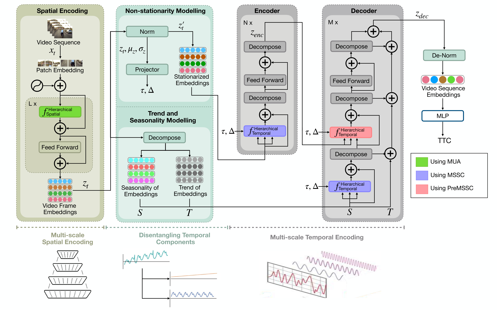

<h1 align="center">CollideNet: Hierarchical Multi-scale Video Representation Learning with Disentanglement for Time-To-Collision Forecasting</h1>

<h3 align="center">
This is an anonymous repository for a paper submitted to ICPR 2026
</h3>


<p align="center"></p>

## Overview
This repo contains the PyTorch-based implementation code for CollideNet and the related toolkit for multi-scale hierarchical Time-To-Collision forecasting.

 
- We present a novel two-stream hierarchical multi-scale transformer architecture in CollideNet, specifically designed to cater to the hierarchical spatial and temporal features for TTC forecasting in videos. 
- For the first time in the context of TTC, we model the disentanglement of temporal patterns namely non-stationarity, trend, and seasonality for temporal encoding, to enhance forecasting. We further notice that the effect of disentanglement is compounded due to the multi-scale architecture.
- Our method achieves state-of-the-art performance on three datasets, especially outperforming previous methods by a large margin in the CCD dataset. Furthermore, we also demonstrate the generalizability of the out model via cross-dataset evaluation.

## Files
- **preprocess.py**: Python script to Pre-process videos of the datasets for uniform temporal and spatial dimensions.
- **Models**: This folder contains the source code for the PyTorch based implementation of the CollideNet and baseline models on the Time-To-Collision Forecasting task.
- **Dataset**: This folder contains the csv files containing links and annotations of 3 datasets (CCD/DoTA/DAD).
- **data_loader.py**: Python script for implementing PyTorch-based Data loader for the datasets.
- **get_model.py**: Python script to load the baseline models, and the proposed CollideNet.
- **main.py</a>**: Python script to run the training and evaluation of the proposed CollideNet and baselines on the 3 datasets.

## Preparing the datasets
1. **Installing Packages**
   - Run the following command to make sure the necessary packages are installed.
   ```    
   pip install -r requirements.txt
   ```

2. **Downloading the dataset**
   - Download the video datasets from respective available platforms
   - Set the paths for the video directory of the dataset.

4. **Preprocessing the videos**
   - Set the paths for the dataset.csv, the directory where videos are stored, and the output directory in pre_process.py
   - Run the preprocess.py file.
   ```    
   python download/preprocess.py
   ```


## Training VidNeXt

<p align="center"></p>

- Run src/main.py with the required hyperparameter setting in arguments.
```    
python src/main.py -dataset <DATASET_NAME> -vid_dir <PATH_TO_PREPROCESSED_VIDEOS> -model <MODEL_NAME> 
```


## Results

### Comparison of Methods Across Datasets (MSE)

| Methods                     | Backbone                      | CCD  | DoTA | DAD  |
|-----------------------------|------------------------------|------|------|------|
| CNN-RNN                     | EfficientNet                 | 0.93 | 1.79 | 0.75 |
| C3D                         | 3D ConvNet                   | 1.98 | 3.59 | 1.75 |
| ResNet50 3D                 | 3D ConvNet                   | 0.87 | 2.11 | 0.88 |
| VGG-16                      | VGG-16                       | 0.54 | _1.78_ | 0.74 |
| X3D                         | 3D ConvNet                   | 0.85 | 2.21 | 0.85 |
| ViViT                       | Vision Transformer           | 0.82 | 2.13 | 1.02 |
| TimeSformer                 | Vision Transformer           | 0.63 | 1.98 | 0.79 |
| Video Swin Transformer      | Swin Transformer            | 0.62 | 2.03 | 0.79 |
| Li3D                        | 3D ConvNet                   | 1.42 | 2.45 | 0.90 |
| HyCT                        | CNN-Transformer Hybrid       | 0.78 | 2.13 | 0.91 |
| Video-FocalNet              | Focal Modulation Nets        | 0.58 | 2.00 | _0.73_ |
| VidNeXt                     | ConvNeXt                     | _0.53_ | 1.89 | 0.77 |
| **CollideNet (Ours)**       | Multi-scale Vision Transformer | **0.37** | **1.75** | **0.71** |

_Italicized_ values represent the second-best result, and **bold** values indicate the best performance.


### Acknowledgements

This project includes code and dataset borrowed from the following:
- [Car Crash Dataset](https://github.com/Cogito2012/CarCrashDataset).
- [Detection of Traffic Anomaly Dataset](https://github.com/MoonBlvd/Detection-of-Traffic-Anomaly/tree/master).
- [Dashcam Accident Dataset](https://github.com/smallcorgi/Anticipating-Accidents).
- [NearCollision](https://github.com/aashi7/NearCollision/tree/master).
- [ViViT](https://github.com/google-research/vision_transformer) by Google Research.
- [Non-stationary Trasnformer](https://github.com/thuml/Nonstationary_Transformers).
- [VidNeXT](https://github.com/DeSinister/CycleCrash/blob/main/README.md).
- [TimeSformer](https://github.com/facebookresearch/TimeSformer) by Facebook Research.
- [3D ResNet, X3D](https://github.com/facebookresearch/pytorchvideo) by Facebook Research.
- [Video Swin Transformer](https://github.com/SwinTransformer/Video-Swin-Transformer) by Microsoft.
- [Video FocalNets](https://github.com/TalalWasim/Video-FocalNets).

